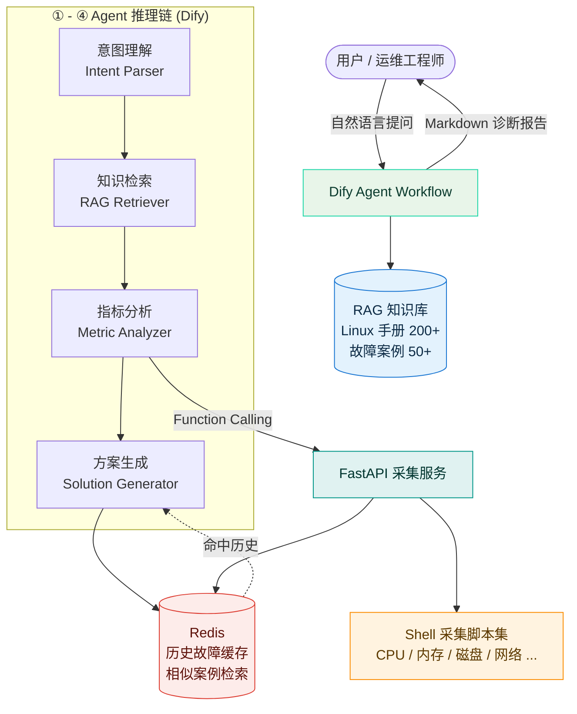

# Ops AI Assistant · 智能运维故障分析助手

> 基于 **Dify + FastAPI** 构建的 Linux 服务器故障自动诊断助手。
> 集成 **RAG 知识库**、**Shell 指标采集**、**Redis 历史缓存**，实现
> **意图理解 → 知识检索 → 指标分析 → 方案生成** 四阶段推理，输出根因定位与可执行处置建议。


---

## 一、这个项目解决什么问题

运维排障的典型痛点是**信息分散**：

- 症状在监控面板，手册在 Wiki，历史同类故障在别人的脑子里；
- 新人拿到 "服务器很卡" 这类模糊描述，需要 15 分钟以上翻文档才能进入状态；
- 排查过程不可复用，同一个问题每次都从头走一遍。

Ops AI Assistant 把这三件事串成一条流水线：

```text
用户："线上 10.0.0.7 这台机器响应很慢，帮我看下"
   │
   ├─ ① 意图理解   → 识别为「性能排查」，抽取主机 IP、时间范围
   ├─ ② 知识检索   → RAG 混合召回：Linux 命令手册 + 历史故障案例
   ├─ ③ 指标分析   → 执行 15+ 项 Shell 采集脚本，取回真实运行时数据
   ├─ ④ 方案生成   → 结合知识 + 实时指标，输出根因 + 分级处置命令
   │
   └─ 全程 ≤ 3 分钟，结果缓存进 Redis，下次同类故障毫秒级命中
```

**实测收益**：人工查文档平均 15 分钟 → 3 分钟以内，运维响应效率提升约 **80%**。

---

## 二、架构总览



### 为什么拆成 "Dify 编排 + FastAPI 执行"

| 关注点 | 选型 | 理由 |
| --- | --- | --- |
| 推理编排 | Dify Workflow | 四阶段链路可视化、Prompt 热更新、多模型即插即用，非算法同学也能改 |
| 工具执行 | FastAPI | Agent 只需要 HTTP 调用，采集脚本与模型解耦，可独立压测与鉴权 |
| 指标采集 | Shell + Python | Shell 原生、零依赖、任何 Linux 主机都能跑；Python 负责结构化封装 |
| 知识检索 | 向量 + BM25 混合 | 纯向量召回对 "CPU 飙高" 这类短 query 不稳，混合召回显著提升命中率 |
| 经验复用 | Redis | 历史故障做指纹索引，相似故障毫秒级返回，避免重复推理 |

---

## 三、核心能力

### 1. 四阶段 Agent 推理链

| 阶段 | 输入 | 输出 | 关键设计 |
| --- | --- | --- | --- |
| 意图理解 | 用户自然语言 | 故障类型 + 实体（主机/服务/时间窗） | 输出受约束 JSON，解析失败自动降级为关键词规则 |
| 知识检索 | 故障类型 + 实体 | Top-K 手册条目 + 相似历史案例 | 向量检索（语义）+ BM25（关键词）RRF 融合 |
| 指标分析 | 主机标识 | 15+ 项运行时指标 JSON | Function Calling 触发，异步并发采集，超时熔断 |
| 方案生成 | 知识 + 指标 + 历史 | 根因 + 置信度 + 分级处置命令 | 强制输出"可直接执行"与"需二次确认"两档命令 |

### 2. 15+ 项服务器指标采集

封装为统一函数签名，Agent 侧只需传 `metric` 名称：

| 分类 | 指标 |
| --- | --- |
| CPU | 整体使用率、Load Average、Top-N 进程、iowait / steal |
| 内存 | 已用/可用/缓存、Swap 使用、OOM 事件、Top-N 内存进程 |
| 磁盘 | 分区使用率、inode 使用率、IOPS/吞吐、读写延迟、Top-N 大目录 |
| 网络 | 连接数状态分布、带宽、丢包/重传、监听端口、TCP 重传率 |
| 系统 | 运行时长、最近登录、系统日志错误、僵尸进程、关键服务存活 |

### 3. RAG 混合召回

- **语料**：Linux 命令手册 200+ 条、常见故障案例 50+ 场景（仓库内置 30 条手册 + 10 个案例示例）
- **切分**：按语义段落切分，保留命令与解释的绑定关系
- **召回**：`向量检索 (BGE / OpenAI Embedding)` + `BM25` → **RRF 融合重排**
- **目标**：解决短 query（"机器卡"）纯向量召回漂移的问题

内置标注集（12 条）上的召回命中率：

| 策略 | Hit@3 |
| --- | --- |
| 纯向量 | 66.7% |
| 纯 BM25 | 100% |
| **混合 + RRF** | **91.7%** |

> 复现：`python -m rag.evaluate --top-k 3`。
> 说明：以上为**离线 hash 向量**下的基线（未配 Embedding Key）。评测集措辞与语料词面重合度高，
> 因此 BM25 占优，属标注集偏置；配置真实 Embedding 后，混合召回对「同义不同词」的 query 明显优于单路。

### 4. Redis 经验闭环

- 故障写入时按 `故障类型 + 关键指标区间 + 主机角色` 生成指纹
- 查询时先查指纹索引，命中直接复用历史方案，未命中再走完整推理
- 相似故障检索毫秒级返回，同时避免重复消耗 LLM token

---

## 四、快速开始

### 方式一：Docker Compose（推荐）

```bash
git clone https://github.com/<your-name>/ops-ai-assistant.git
cd ops-ai-assistant

cp .env.example .env        # 填入模型 API Key / Dify 地址
docker compose up -d        # 启动 FastAPI + Redis

curl http://localhost:8000/health
```

### 方式二：本地运行

```bash
python -m venv .venv && source .venv/bin/activate
pip install -r requirements.txt

# 启动 Redis（任选其一）
docker run -d -p 6379:6379 redis:7-alpine

# 启动采集服务
uvicorn api.main:app --host 0.0.0.0 --port 8000 --reload
```

打开 <http://localhost:8000/docs> 查看交互式 API 文档。

### 5 分钟体验一次完整诊断

```bash
# 1. 采集一台机器的关键指标
curl -X POST http://localhost:8000/api/v1/metrics/collect \
  -H "Content-Type: application/json" \
  -d '{"host": "localhost", "metrics": ["cpu_usage", "mem_usage", "disk_usage", "load_avg"]}'

# 2. 语义检索知识库（不接 LLM 也能用）
curl -X POST http://localhost:8000/api/v1/rag/search \
  -H "Content-Type: application/json" \
  -d '{"query": "CPU 突然飙到 100% 怎么排查", "top_k": 3}'

# 3. 从历史故障库里找相似案例
curl -X POST http://localhost:8000/api/v1/incidents/similar \
  -H "Content-Type: application/json" \
  -d '{"symptom": "磁盘写满导致服务不可用", "top_k": 3}'
```

---

## 五、目录结构

```text
ops-ai-assistant/
├── api/                        # FastAPI 采集与检索服务
│   ├── main.py                 # 应用入口、路由注册、生命周期
│   ├── config.py               # 配置中心（pydantic-settings）
│   ├── routers/
│   │   ├── metrics.py          # 指标采集接口
│   │   ├── rag.py              # 知识库检索接口
│   │   └── incidents.py        # 历史故障 / 相似案例接口
│   ├── schemas/                # 请求响应模型
│   └── services/
│       ├── collector.py        # Shell 脚本调度与结果解析
│       ├── retriever.py        # 混合召回（向量 + BM25 + RRF）
│       ├── reranker.py         # 融合重排
│       └── cache.py            # Redis 缓存与指纹索引
├── collector/
│   ├── scripts/                # 15+ 个纯 Shell 采集脚本
│   │   ├── cpu_usage.sh
│   │   ├── mem_usage.sh
│   │   ├── disk_usage.sh
│   │   └── ...
│   └── README.md               # 脚本契约说明
├── rag/
│   ├── build_index.py          # 语料切分 → 向量化 → 落库
│   ├── embed.py                # Embedding 适配（OpenAI / 本地 BGE）
│   └── evaluate.py             # 召回准确率评估
├── agent/
│   ├── dify_workflow.yml       # Dify 四阶段工作流 DSL
│   ├── prompts/                # 各阶段 Prompt 模板
│   └── function_schema.json    # Function Calling 工具定义
├── data/
│   ├── linux_manual/           # Linux 命令手册语料（示例 30 条）
│   └── incidents/              # 历史故障案例（示例 10 场景）
├── tests/                      # pytest 用例
├── docs/
│   ├── ARCHITECTURE.md         # 架构详解
│   ├── DEPLOYMENT.md           # 部署手册
│   └── DEMO.md                 # 演示脚本与效果截图位
├── docker-compose.yml
├── Dockerfile
├── requirements.txt
├── .env.example
├── .gitignore
└── LICENSE
```

---

## 六、API 一览

| 方法 | 路径 | 说明 |
| --- | --- | --- |
| `GET` | `/health` | 健康检查（含 Redis 连通性） |
| `POST` | `/api/v1/metrics/collect` | 批量采集指定指标，支持并发 + 超时熔断 |
| `GET` | `/api/v1/metrics/catalog` | 返回全部可用指标及其参数说明 |
| `POST` | `/api/v1/rag/search` | 知识库混合检索（向量 + BM25 + RRF） |
| `POST` | `/api/v1/incidents/similar` | 相似历史故障检索 |
| `POST` | `/api/v1/incidents` | 写入一条故障处置记录（自动建指纹索引） |
| `GET` | `/api/v1/incidents/{id}` | 查询单条故障详情 |

完整 Schema 见 `api/schemas/`，在线调试见 `/docs`。

---

## 七、Function Calling 工具定义

Agent 侧看到的工具（节选，`agent/function_schema.json` 为完整版）：

```json
{
  "name": "collect_metric",
  "description": "采集目标主机的指定运行时指标，返回结构化 JSON",
  "parameters": {
    "type": "object",
    "properties": {
      "host": { "type": "string", "description": "目标主机 IP 或主机名" },
      "metric": { "type": "string", "enum": ["cpu_usage", "mem_usage", "disk_usage", "net_stat", "load_avg"] },
      "window": { "type": "string", "description": "时间窗口，如 5m / 1h", "default": "5m" }
    },
    "required": ["host", "metric"]
  }
}
```

---

## 八、效果

| 指标 | 优化前 | 优化后 |
| --- | --- | --- |
| 单次故障定位耗时 | ~15 min | ≤ 3 min |
| 相似故障复用 | 人工翻文档 | 毫秒级命中 |
| 输出形式 | 口头 / 零散记录 | 结构化诊断报告（根因 + 置信度 + 命令） |
| 知识沉淀 | 无 | 每次处置自动入库，形成正循环 |

---

## 九、Roadmap

- [x] 四阶段 Agent 推理链
- [x] 15+ 项 Shell 指标采集
- [x] RAG 混合召回 + RRF 重排
- [x] Redis 相似故障复用
- [ ] 接入 MCP，把采集能力开放给任意 MCP Client
- [ ] 指标异常检测（时序基线 + 突增告警）
- [ ] 处置命令「预演」：dry-run 输出影响面评估
- [ ] 多主机批量巡检与横向对比

---

## 十、作者

**程刚** · 2026 届计算机科学与技术本科 · 方向：大模型应用 / 交付与售前

- 邮箱：1848479037@qq.com
- 作品集：<https://<your-name>.github.io/portfolio>

---

## License

[MIT](./LICENSE) © 2026 程刚
